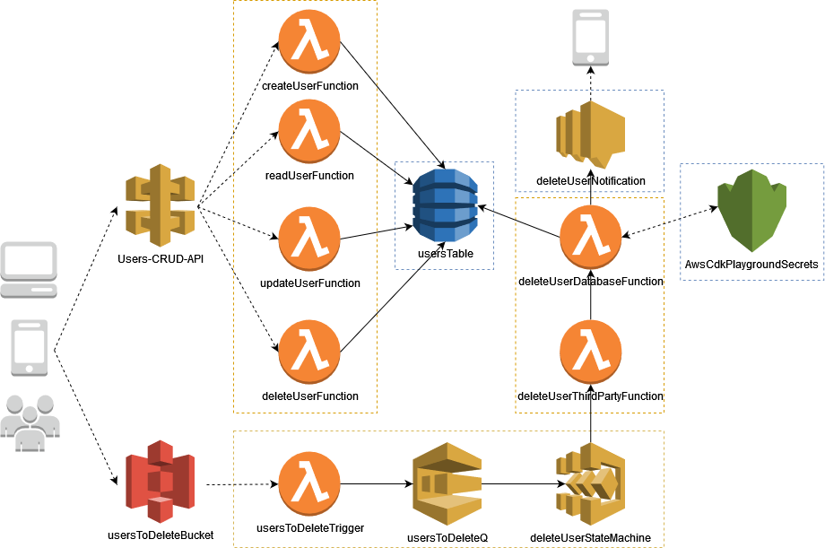

# AWS CDK Playground Project!

 

This project currently contains a app folder with all the IAC code and a src folder with "actual" code for the services, and those being API Gateway, Lambda, DynamoDB, StepFunctions, S3, SQS, SNS, KMS, hope to increase this in the future.

## Folder structure

```
.
├── ...
├── .github                 # Github config folder
│   ├── workflows           # github actions workflow
├── .husky                  # Husky config folder
│   ├── pre-commit          # handler for pre-commit commands
├── .vscode                 # Vscode config folder
│   ├── settings            # useful settings for vscode
├── iac                     # CDK resources code
│   ├── app.ts              # point of start
├── src                     # DDD based folder structure*
│   ├── domain
│   │   ├── entities        # database entities
│   │   ├── repositories    # database repositories
│   ├── handlers            # lambda handlers
└── ...
```
\* [DDD folder structure](https://dev.to/stevescruz/domain-driven-design-ddd-file-structure-4pja)


## Project Architecture



## How to setup for the first time

To setup this project make sure you're using the correct version of node (v16.3.0) and npm (v7.15.1), you could set the correct version with [nvm](https://github.com/nvm-sh/nvm).

- First install this global libraries to help you work with the project:
  ```
  npm -g install typescript aws-cdk
  ```

- Set up an alias so you can use the cdk command with a local CDK Toolkit installation:
  ```
  alias cdk="npx aws-cdk"
  ```

- Run the setup command that will run both the setup and a first build generating both .js files and a cloudformation script contains the current stack:
  ```
  npm run setup
  ```

After that, you can run any of the [useful commands](#useful-commands) for further configuration or testing pourposes.

## Useful commands

 * `npm run setup`   first time setup
 * `npm run build`   transpile typescript files and use cdk synth
 * `npm run test`    perform the jest unit tests
 * `npm run lint`    perform eslint checks
 * `npm run prepare` install husky to execture pre-commit scripts
 * `cdk synth`       emits the synthesized CloudFormation template
 * `cdk deploy`      deploy this stack to your default AWS account/region

## Github actions

### Merge requests

This project contains a .github folder that holds the current workflow for github actions, this will execute a basic validation for all MR open up to check both linting and unit testing.

### After merge / deploy

Since this project is to study only, I remove the deploy part from the workflow and I'll handle all the deploy locally or even manually. (to avoid the fatigue)

If you want to increase your github actions with aws cdk deploy part, I would recommend you to also read about [github secrets](https://docs.github.com/pt/actions/security-guides/encrypted-secrets) and yarn [cache](https://classic.yarnpkg.com/en/docs/cli/cache)
